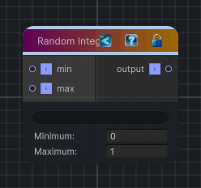

<link rel="stylesheet" href="../_assets/theme.css">

<button type="button" class="genesis-theme-toggle" data-genesis-theme-toggle aria-label="Toggle theme">Dark</button>

---
category: "Function/Random"
---

# Integer

> Generates a random integer value.

## Description

Generates a random integer value.

## Inputs

| Name | Type | Description |
|------|------|-------------|

## Outputs

| Name | Type |
|------|------|

## Parameters

| Setting | Type | Default | Description |
|---------|------|---------|-------------|
| nodeVariables | VariableStorage | AhahGames.GenesisNoise.Graph.VariableStorage | |
| GUID | String | 25f0a7bf-664b-4718-9d1d-f1617dc0c408 | |
| expanded | Boolean | False | |

## See Also

- [Back to Integer](./function-index.md)
