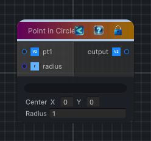

<link rel="stylesheet" href="../_assets/theme.css">

<button type="button" class="genesis-theme-toggle" data-genesis-theme-toggle aria-label="Toggle theme">Dark</button>

---
category: "Function/Random"
---

# Point in Circle

> Generates a random point inside a circle.

## Description

Generates a random point inside a circle.

## Inputs

| Name | Type | Description |
|------|------|-------------|
| radius | Single |  |
| pt1 | Vector2 |  |

## Outputs

| Name | Type |
|------|------|
| output | Vector2 |

## Parameters

| Setting | Type | Default | Description |
|---------|------|---------|-------------|
| nodeVariables | VariableStorage | AhahGames.GenesisNoise.Graph.VariableStorage | |
| GUID | String | fceed065-3d46-4bf9-9800-68ea5076680e | |
| expanded | Boolean | False | |

## See Also

- [Back to Point in Circle](./function-index.md)
