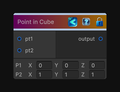

<link rel="stylesheet" href="../_assets/theme.css">

<button type="button" class="genesis-theme-toggle" data-genesis-theme-toggle aria-label="Toggle theme">Dark</button>

---
category: "Function/Random"
---

# Point in Cube

> Generates a random point inside a cube.

## Description

Generates a random point inside a cube.

## Inputs

| Name | Type | Description |
|------|------|-------------|

## Outputs

| Name | Type |
|------|------|

## Parameters

| Setting | Type | Default | Description |
|---------|------|---------|-------------|
| nodeVariables | VariableStorage | AhahGames.GenesisNoise.Graph.VariableStorage | |
| GUID | String | 3453f368-8c8d-417c-92b2-01b2a36f20ad | |
| expanded | Boolean | False | |

## See Also

- [Back to Point in Cube](./function-index.md)
