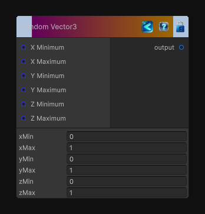

<link rel="stylesheet" href="../_assets/theme.css">

<button type="button" class="genesis-theme-toggle" data-genesis-theme-toggle aria-label="Toggle theme">Dark</button>

---
category: "Function/Random"
---

# Vector3

> Generates a random Vector3 value.

## Description

Generates a random Vector3 value.

## Inputs

| Name | Type | Description |
|------|------|-------------|

## Outputs

| Name | Type |
|------|------|

## Parameters

| Setting | Type | Default | Description |
|---------|------|---------|-------------|
| nodeVariables | VariableStorage | AhahGames.GenesisNoise.Graph.VariableStorage | |
| GUID | String | e3c5bed3-ee0a-481e-9e57-d8d55d9aa3ae | |
| expanded | Boolean | False | |

## See Also

- [Back to Vector3](./function-index.md)
