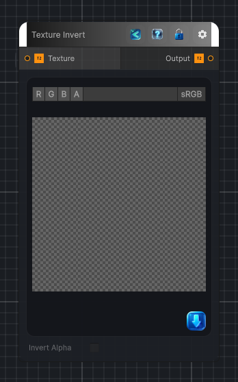

<link rel="stylesheet" href="../_assets/theme.css">

<button type="button" class="genesis-theme-toggle" data-genesis-theme-toggle aria-label="Toggle theme">Dark</button>

---
category: "Function/Texture"
---

# Texture Invert

> Inverts the RGB channels of the source texture per pixel. Alpha is preserved unless Invert Alpha is checked.

## Description

Inverts the RGB channels of the source texture per pixel. Alpha is preserved unless Invert Alpha is checked.

## Inputs

| Name | Type | Description |
|------|------|-------------|

## Outputs

| Name | Type |
|------|------|

## Parameters

| Setting | Type | Default | Description |
|---------|------|---------|-------------|
| nodeVariables | VariableStorage | AhahGames.GenesisNoise.Graph.VariableStorage | |
| GUID | String | 5cb525a3-031b-4059-ac58-ea96b3c52b55 | |
| expanded | Boolean | False | |

## See Also

- [Back to Texture Invert](./function-index.md)
