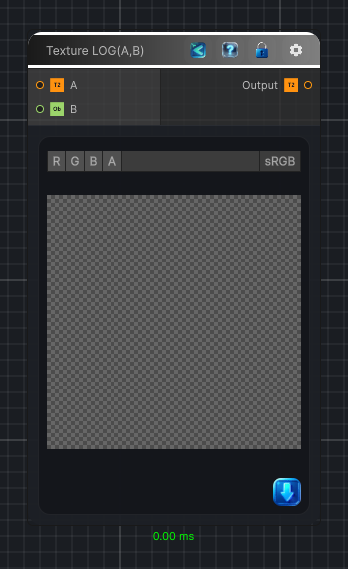

<link rel="stylesheet" href="../_assets/theme.css">

<button type="button" class="genesis-theme-toggle" data-genesis-theme-toggle aria-label="Toggle theme">Dark</button>

---
category: "Function/Texture"
---

# Texture LOG(A,B)

> Applies `LOG(A,B)` to the source texture per pixel.

## Description

Applies `LOG(A,B)` to the source texture per pixel.

## Inputs

| Name | Type | Description |
|------|------|-------------|

## Outputs

| Name | Type |
|------|------|

## Parameters

| Setting | Type | Default | Description |
|---------|------|---------|-------------|
| nodeVariables | VariableStorage | AhahGames.GenesisNoise.Graph.VariableStorage | |
| GUID | String | 5252a26e-adb8-47f5-8138-24d52f7e2018 | |
| expanded | Boolean | False | |

## See Also

- [Back to Texture LOG(A,B)](./function-index.md)
