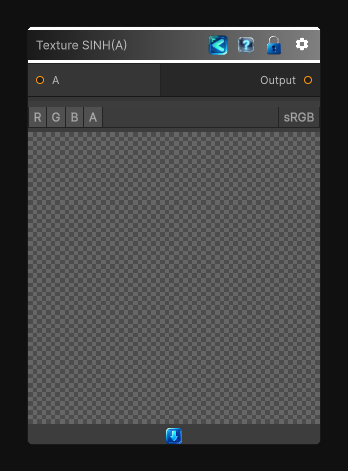

<link rel="stylesheet" href="../_assets/theme.css">

<button type="button" class="genesis-theme-toggle" data-genesis-theme-toggle aria-label="Toggle theme">Dark</button>

---
category: "Function/Texture"
---

# Texture SINH(A)

> Applies `SINH(A)` to the source texture per pixel.

## Description

Applies `SINH(A)` to the source texture per pixel.

## Inputs

| Name | Type | Description |
|------|------|-------------|

## Outputs

| Name | Type |
|------|------|

## Parameters

| Setting | Type | Default | Description |
|---------|------|---------|-------------|
| nodeVariables | VariableStorage | AhahGames.GenesisNoise.Graph.VariableStorage | |
| GUID | String | 9a12085e-4bc9-4a6d-9d3e-3884da40dd59 | |
| expanded | Boolean | False | |

## See Also

- [Back to Texture SINH(A)](./function-index.md)
