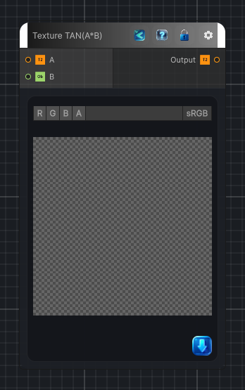

<link rel="stylesheet" href="../_assets/theme.css">

<button type="button" class="genesis-theme-toggle" data-genesis-theme-toggle aria-label="Toggle theme">Dark</button>

---
category: "Function/Texture"
---

# Texture TAN(A*B)

> Applies `TAN(A*B)` to the source texture per pixel.

## Description

Applies `TAN(A*B)` to the source texture per pixel.

## Inputs

| Name | Type | Description |
|------|------|-------------|
| B | Object |  |
| A | Texture2D |  |

## Outputs

| Name | Type |
|------|------|
| Output | Texture2D |

## Parameters

| Setting | Type | Default | Description |
|---------|------|---------|-------------|
| nodeVariables | VariableStorage | AhahGames.GenesisNoise.Graph.VariableStorage | |
| GUID | String | 7db48877-1232-4929-b7fa-07324fe52aec | |
| expanded | Boolean | False | |

## See Also

- [Back to Texture TAN(A*B)](./function-index.md)
