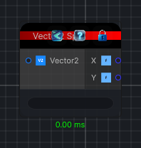

<link rel="stylesheet" href="../_assets/theme.css">

<button type="button" class="genesis-theme-toggle" data-genesis-theme-toggle aria-label="Toggle theme">Dark</button>

---
category: "Function/Vector/Split"
---

# Vector2 Split

> Splits a Vector2 into its X and Y components.

## Description

Splits a Vector2 into its X and Y components.

## Inputs

| Name | Type | Description |
|------|------|-------------|
| Vector2 | Vector2 |  |

## Outputs

| Name | Type |
|------|------|
| Y | Single |
| X | Single |

## Parameters

| Setting | Type | Default | Description |
|---------|------|---------|-------------|
| nodeVariables | VariableStorage | AhahGames.GenesisNoise.Graph.VariableStorage | |
| GUID | String | 797e1982-91da-4bcb-ba3e-61ac40c452cd | |
| expanded | Boolean | False | |

## See Also

- [Back to Vector2 Split](./function-index.md)
