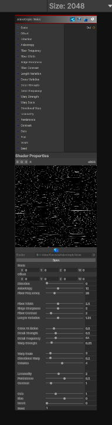

<link rel="stylesheet" href="../_assets/theme.css">

<button type="button" class="genesis-theme-toggle" data-genesis-theme-toggle aria-label="Toggle theme">Dark</button>

---
category: "Generators/Noise"
---

# Anisotropic Noise

> Generates anisotropic noise procedural noise.

## Description

Generates anisotropic noise procedural noise.

Inputs:
- No external inputs. This node generates its output from its internal parameters.

Settings:
- No additional settings. This node is controlled by its built-in behavior.

Output:
- A generated procedural texture based on the node parameters.

## Inputs

| Name | Type | Description |
|------|------|-------------|

## Outputs

| Name | Type |
|------|------|

## Parameters

| Setting | Type | Default | Description |
|---------|------|---------|-------------|
| Scale | Vector | (8,8,0,0) | Global UV scale |
| Offset | Vector | (0,0,0,0) | Global UV offset |
| Direction | Range | 0.0 | Fiber direction in radians |
| Anisotropy | Range | 10.0 | Longitudinal stretch. Higher means longer fibers |
| Fiber Frequency | Range | 28.0 | Base fiber density repetition |
| Fiber Width | Range | 2.5 | Fiber width shaping |
| Ridge Sharpness | Range | 5.0 | Ridge sharpness |
| Fiber Contrast | Range | 2.0 | Fiber contrast |
| Length Variation | Range | 1.25 | Longitudinal intensity variation |
| Cross Variation | Range | 0.8 | Cross fiber breakup amount |
| Detail Strength | Range | 0.5 | Micro detail amount |
| Detail Frequency | Range | 64.0 | Micro detail frequency |
| Warp Strength | Range | 0.25 | Domain warp strength |
| Warp Scale | Range | 3.0 | Domain warp scale |
| Directional Warp | Range | 0.2 | Secondary directional warp |
| Octaves | Range | 4 | Number of fBm octaves |
| Lacunarity | Range | 2.0 | Frequency multiplier |
| Persistence | Range | 0.5 | Amplitude multiplier |
| Contrast | Range | 1.0 | Final contrast shaping |
| Gain | Range | 1.0 | Final gain |
| Bias | Range | 0.0 | Final bias |
| Invert | Range | 0 | Invert output |
| Seed | int | 1 | Random seed |

## See Also

- [Back to Anisotropic Noise](./generators-index.md)
