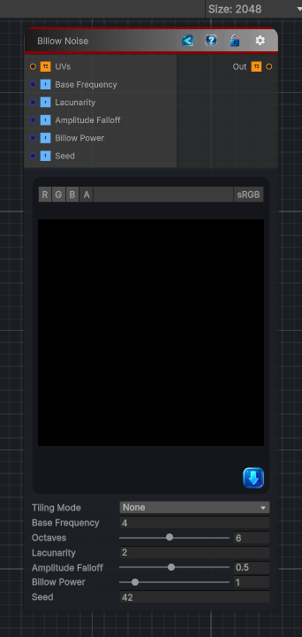

<link rel="stylesheet" href="../_assets/theme.css">

<button type="button" class="genesis-theme-toggle" data-genesis-theme-toggle aria-label="Toggle theme">Dark</button>

---
category: "Generators/Noise"
---

# Billow Noise

> Generates billow fractal noise, an octave-stacked value noise that folds the low-frequency signal into rounded peaks and valleys.

## Description

Generates billow fractal noise, an octave-stacked value noise that folds the low-frequency signal into rounded peaks and valleys.

Inputs:
- No external inputs. This node generates its output from its internal parameters.

Settings:
- Frequency, octaves, lacunarity, falloff, and power control the fractal shape.
- Billow power sharpens or softens the folded peaks.

Output:
- A generated procedural texture based on the node parameters.

## Inputs

| Name | Type | Description |
|------|------|-------------|

## Outputs

| Name | Type |
|------|------|

## Parameters

| Setting | Type | Default | Description |
|---------|------|---------|-------------|
| Tiling Mode | Keyword Enum | 0 | Controls the tiling mode. |
| UV Mode | Enum | 0 | Controls the uv mode. |
| Output Range | Vector2 | (0, 1, 0, 0) | Controls the output range. |
| Base Frequency | Float | 4 | Controls the base frequency. |
| Octaves | Int Range | 6 | Controls the octaves. |
| Lacunarity | Float | 2 | Controls the lacunarity. |
| Amplitude Falloff | Range | 0.5 | Controls the amplitude falloff. |
| Billow Power | Range | 1.0 | Controls the billow power. |
| Seed | Int | 42 | Controls the seed. |
| Channels | Enum | 0 | Select how many noise values to generate and which channels to write. More channels cost more noise evaluations. |

## See Also

- [Back to Billow Noise](./generators-index.md)
