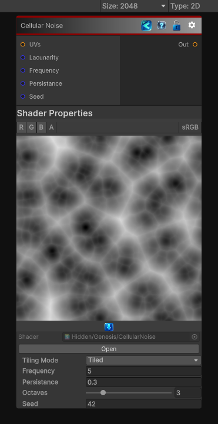

<link rel="stylesheet" href="../_assets/theme.css">

<button type="button" class="genesis-theme-toggle" data-genesis-theme-toggle aria-label="Toggle theme">Dark</button>

---
category: "Generators/Noise"
---

# Cellular Noise

> Generates cellular noise procedural noise.

## Description

Generates cellular noise procedural noise.

Inputs:
- No external inputs. This node generates its output from its internal parameters.

Settings:
- No additional settings. This node is controlled by its built-in behavior.

Output:
- A generated procedural texture based on the node parameters.

## Inputs

| Name | Type | Description |
|------|------|-------------|

## Outputs

| Name | Type |
|------|------|

## Parameters

| Setting | Type | Default | Description |
|---------|------|---------|-------------|
| Tiling Mode | Keyword Enum | 1 | Controls the tiling mode. |
| UV Mode | Enum | 0 | Controls the uv mode. |
| Distance Mode | Enum | 0 | Controls the distance mode. |
| Output Range | Vector2 | (0, 1, 0, 0) | Controls the output range. |
| Lacunarity | Float | 2 | Controls the lacunarity. |
| Frequency | Float | 5 | Controls the frequency. |
| Persistance | Float | 0.3 | Controls the persistance. |
| Octaves | Int Range | 3 | Controls the octaves. |
| Cell Size | Float | 1 | Act as a multiplier for the distance function |
| Seed | Int | 42 | Controls the seed. |
| Channels | Enum | 0 | Select how many noise to genereate and on which channel. The more different channel you use the more expensive it is (max 4 noise evaluation). |
| Cells Mode R | Enum | 0 | Controls the cells mode r. |
| Cells Mode G | Enum | 0 | Controls the cells mode g. |
| Cells Mode B | Enum | 0 | Controls the cells mode b. |
| Cells Mode A | Enum | 0 | Controls the cells mode a. |

## See Also

- [Back to Cellular Noise](./generators-index.md)
