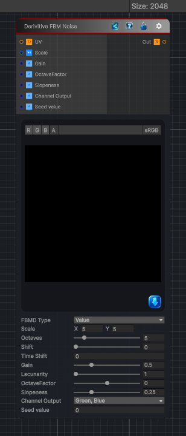

<link rel="stylesheet" href="../_assets/theme.css">

<button type="button" class="genesis-theme-toggle" data-genesis-theme-toggle aria-label="Toggle theme">Dark</button>

---
category: "Generators/Noise"
---

# Derivative FBM

> Generates fbmdnoise procedural noise.

## Description

Generates fbmdnoise procedural noise.

Inputs:
- No external inputs. This node generates its output from its internal parameters.

Settings:
- No additional settings. This node is controlled by its built-in behavior.

Output:
- A generated procedural texture based on the node parameters.

## Inputs

| Name | Type | Description |
|------|------|-------------|
| UV | Texture2D |  |
| Scale | Vector4 | Number of tiles, x and y |
| Gain | Single | Gain for each octave |
| OctaveFactor | Single | The octave intensity factor |
| Slopeness | Single |  |
| Channel Output | Single |  |
| Seed value | Single |  |

## Outputs

| Name | Type |
|------|------|
| Out | Texture2D |

## Parameters

| Setting | Type | Default | Description |
|---------|------|---------|-------------|
| FBMD Type | Enum | 0 | The variant of input for FBMD |
| Scale | vector | (5,5,0,0) | Number of tiles, x and y |
| Octaves | Range | 5 | Controls the octaves. |
| Axial Shift | Float | 0 | Axial or rotational shift for each octave |
| Shift | Range | 0 | Position shift for each octave |
| Mode | Enum | 0 | Mode used in combining the noise for the octaves |
| Time Shift | Float | 0 | Time shift for each octave |
| Gain | Range | 0.5 | Gain for each octave |
| Lacunarity | Range | 1 | Controls the lacunarity. |
| OctaveFactor | Range | 0 | The octave intensity factor |
| Slopeness | Range | 0.25 | Controls the slopeness. |
| Offset | Range | 0 | Offsets the value of the noise |
| Channel Output | int | 6 | Controls the channel output. |
| Seed value | int | 0 | Controls the seed value. |

## See Also

- [Back to Derivative FBM](./generators-index.md)
