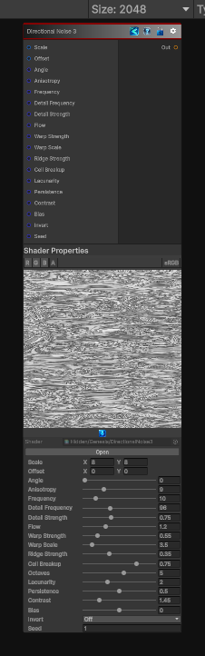

<link rel="stylesheet" href="../_assets/theme.css">

<button type="button" class="genesis-theme-toggle" data-genesis-theme-toggle aria-label="Toggle theme">Dark</button>

---
category: "Generators/Noise"
---

# Directional Noise 3

> Generates directional noise 3 procedural noise.

## Description

Generates directional noise 3 procedural noise.

Inputs:
- No external inputs. This node generates its output from its internal parameters.

Settings:
- No additional settings. This node is controlled by its built-in behavior.

Output:
- A generated procedural texture based on the node parameters.

## Inputs

| Name | Type | Description |
|------|------|-------------|

## Outputs

| Name | Type |
|------|------|

## Parameters

| Setting | Type | Default | Description |
|---------|------|---------|-------------|
| Scale | Vector2 | (8, 8, 0, 0) | Global UV scale |
| Offset | Vector2 | (0, 0, 0, 0) | Global UV offset |
| Angle | Range | 0.0 | Direction of the noise in radians |
| Anisotropy | Range | 9.0 | Stretch along the chosen direction |
| Frequency | Range | 10.0 | Base feature frequency |
| Detail Frequency | Range | 96.0 | Fine directional detail frequency |
| Detail Strength | Range | 0.75 | Amount of fine detail mixed into the result |
| Flow | Range | 1.2 | How much the direction meanders |
| Warp Strength | Range | 0.55 | Domain warp strength |
| Warp Scale | Range | 3.5 | Domain warp scale |
| Ridge Strength | Range | 0.35 | Ridge shaping amount |
| Cell Breakup | Range | 0.75 | Cellular directional breakup amount |
| Octaves | Int Range | 5 | Number of fBm octaves |
| Lacunarity | Range | 2.0 | Frequency multiplier between octaves |
| Persistence | Range | 0.5 | Amplitude multiplier between octaves |
| Contrast | Range | 1.45 | Final contrast |
| Bias | Range | 0.0 | Final brightness bias |
| Invert | Enum | 0 | Invert output |
| Seed | Float | 1.0 | Randomization seed |

## See Also

- [Back to Directional Noise 3](./generators-index.md)
