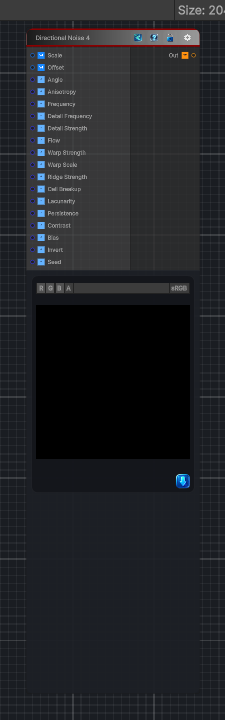

<link rel="stylesheet" href="../_assets/theme.css">

<button type="button" class="genesis-theme-toggle" data-genesis-theme-toggle aria-label="Toggle theme">Dark</button>

---
category: "Generators/Noise"
---

# Directional Noise 4

> Generates directional noise 4 procedural noise.

## Description

Generates directional noise 4 procedural noise.

Inputs:
- No external inputs. This node generates its output from its internal parameters.

Settings:
- No additional settings. This node is controlled by its built-in behavior.

Output:
- A generated procedural texture based on the node parameters.

## Inputs

| Name | Type | Description |
|------|------|-------------|
| Scale | Vector4 | Global UV scale |
| Offset | Vector4 | Global UV offset |
| Angle | Single | Direction of the noise in radians |
| Anisotropy | Single | Stretch along the chosen direction |
| Frequency | Single | Base feature frequency |
| Detail Frequency | Single | Fine directional detail frequency |
| Detail Strength | Single | Amount of fine detail mixed into the result |
| Flow | Single | How much the direction meanders |
| Warp Strength | Single | Domain warp strength |
| Warp Scale | Single | Domain warp scale |
| Ridge Strength | Single | Ridge shaping amount |
| Cell Breakup | Single | Cellular directional breakup amount |
| Lacunarity | Single | Frequency multiplier between octaves |
| Persistence | Single | Amplitude multiplier between octaves |
| Contrast | Single | Final contrast |
| Bias | Single | Final brightness bias |
| Invert | Single | Invert output |
| Seed | Single | Randomization seed |

## Outputs

| Name | Type |
|------|------|
| Out | Texture2D |

## Parameters

| Setting | Type | Default | Description |
|---------|------|---------|-------------|
| Scale | Vector2 | (10, 10, 0, 0) | Global UV scale |
| Offset | Vector2 | (0, 0, 0, 0) | Global UV offset |
| Angle | Range | 0.0 | Direction of the noise in radians |
| Anisotropy | Range | 16.0 | Stretch along the chosen direction |
| Frequency | Range | 16.0 | Base feature frequency |
| Detail Frequency | Range | 140.0 | Fine directional detail frequency |
| Detail Strength | Range | 1.15 | Amount of fine detail mixed into the result |
| Flow | Range | 0.75 | How much the direction meanders |
| Warp Strength | Range | 0.2 | Domain warp strength |
| Warp Scale | Range | 5.0 | Domain warp scale |
| Ridge Strength | Range | 0.85 | Ridge shaping amount |
| Cell Breakup | Range | 0.35 | Cellular directional breakup amount |
| Octaves | Int Range | 6 | Number of fBm octaves |
| Lacunarity | Range | 2.0 | Frequency multiplier between octaves |
| Persistence | Range | 0.5 | Amplitude multiplier between octaves |
| Contrast | Range | 1.8 | Final contrast |
| Bias | Range | 0.0 | Final brightness bias |
| Invert | Enum | 0 | Invert output |
| Seed | Float | 1.0 | Randomization seed |

## See Also

- [Back to Directional Noise 4](./generators-index.md)
