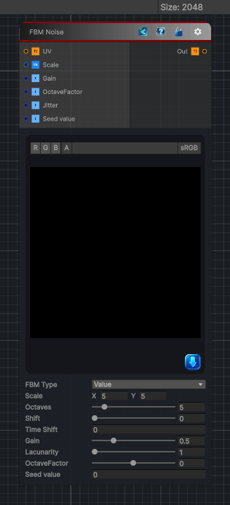

<link rel="stylesheet" href="../_assets/theme.css">

<button type="button" class="genesis-theme-toggle" data-genesis-theme-toggle aria-label="Toggle theme">Dark</button>

---
category: "Generators/Noise"
---

# FBM

> Generates fbmnoise procedural noise.

## Description

Generates fbmnoise procedural noise.

Inputs:
- No external inputs. This node generates its output from its internal parameters.

Settings:
- No additional settings. This node is controlled by its built-in behavior.

Output:
- A generated procedural texture based on the node parameters.

## Inputs

| Name | Type | Description |
|------|------|-------------|
| UV | Texture2D |  |
| Scale | Vector4 | Number of tiles, x and y |
| Gain | Single | Gain for each octave |
| OctaveFactor | Single | The octave intensity factor, the lower the more pronounced the lower octaves will be |
| Jitter | Single |  |
| Seed value | Single |  |

## Outputs

| Name | Type |
|------|------|
| Out | Texture2D |

## Parameters

| Setting | Type | Default | Description |
|---------|------|---------|-------------|
| FBM Type | Enum | 0 | The variant of input for FBM |
| Scale | vector | (5,5,0,0) | Number of tiles, x and y |
| Octaves | Range | 5 | Controls the octaves. |
| Axial Shift | Float | 0 | Axial or rotational shift for each octave |
| Shift | Range | 0 | Position shift for each octave |
| Mode | Enum | 0 | Mode used in combining the noise for the ocatves |
| Time Shift | Float | 0 | Time shift for each octave |
| Gain | Range | 0.5 | Gain for each octave |
| Lacunarity | Range | 1 | Controls the lacunarity. |
| OctaveFactor | Range | 0 | The octave intensity factor, the lower the more pronounced the lower octaves will be |
| Pow Intensity | Range | 1.0 | Pow intensity factor |
| Offset | Range | 0 | Offsets the value of the noise |
| Interpolate | Float | 0 | Interpolate factor between the multiplication mode and normal mode |
| Jitter | Range | 1.0 | Jitter factor for the cells, if zero then it will result in a square grid |
| Translate | Vector | (0.5,-0.25,0.15,0) | Translate factors for the value noise |
| Warp Strength | Range | 0.5 | The warp factor used for domain warping |
| Width | Range | 0.1 | Width of the metaballs |
| Softness | Range | 0.01 | Softness of the meatballs |
| Seed value | int | 0 | Controls the seed value. |

## See Also

- [Back to FBM](./generators-index.md)
