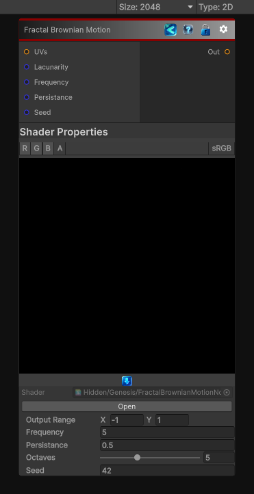

<link rel="stylesheet" href="../_assets/theme.css">

<button type="button" class="genesis-theme-toggle" data-genesis-theme-toggle aria-label="Toggle theme">Dark</button>

---
category: "Generators/Noise"
---

# Fractal Brownian Motion

> Generates fractal brownian motion noise procedural noise.

## Description

Generates fractal brownian motion noise procedural noise.

Inputs:
- No external inputs. This node generates its output from its internal parameters.

Settings:
- No additional settings. This node is controlled by its built-in behavior.

Output:
- A generated procedural texture based on the node parameters.

## Inputs

| Name | Type | Description |
|------|------|-------------|

## Outputs

| Name | Type |
|------|------|

## Parameters

| Setting | Type | Default | Description |
|---------|------|---------|-------------|
| Output Range | Vector2 | (-1, 1, 0, 0) | Controls the output range. |
| Lacunarity | Float | 2 | Controls the lacunarity. |
| Frequency | Float | 5 | Controls the frequency. |
| Persistance | Float | 0.5 | Controls the persistance. |
| Octaves | Int Range | 5 | Controls the octaves. |
| Seed | Int | 42 | Controls the seed. |

## See Also

- [Back to Fractal Brownian Motion](./generators-index.md)
