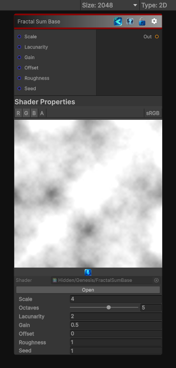

<link rel="stylesheet" href="../_assets/theme.css">

<button type="button" class="genesis-theme-toggle" data-genesis-theme-toggle aria-label="Toggle theme">Dark</button>

---
category: "Generators/Noise"
---

# Fractal Sum Base

> Generates fractal sum base procedural noise.

## Description

Generates fractal sum base procedural noise.

Inputs:
- No external inputs. This node generates its output from its internal parameters.

Settings:
- No additional settings. This node is controlled by its built-in behavior.

Output:
- A generated procedural texture based on the node parameters.

## Inputs

| Name | Type | Description |
|------|------|-------------|

## Outputs

| Name | Type |
|------|------|

## Parameters

| Setting | Type | Default | Description |
|---------|------|---------|-------------|
| Scale | Float | 4.0 | Global scale of the noise |
| Octaves | Range | 5 | Number of octaves (1 to 8) |
| Lacunarity | Float | 2.0 | Frequency multiplier per octave |
| Gain | Float | 0.5 | Amplitude multiplier per octave |
| Offset | Float | 0.0 | Offset added to each octave |
| Roughness | Float | 1.0 | Roughness shaping |
| Seed | Float | 1.0 | Random seed |

## See Also

- [Back to Fractal Sum Base](./generators-index.md)
