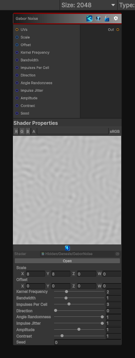

<link rel="stylesheet" href="../_assets/theme.css">

<button type="button" class="genesis-theme-toggle" data-genesis-theme-toggle aria-label="Toggle theme">Dark</button>

---
category: "Generators/Noise"
---

# Gabor Noise

> Generates gabor noise procedural noise.

## Description

Generates gabor noise procedural noise.

Inputs:
- No external inputs. This node generates its output from its internal parameters.

Settings:
- No additional settings. This node is controlled by its built-in behavior.

Output:
- A generated procedural texture based on the node parameters.

## Inputs

| Name | Type | Description |
|------|------|-------------|

## Outputs

| Name | Type |
|------|------|

## Parameters

| Setting | Type | Default | Description |
|---------|------|---------|-------------|
| Scale | Vector | (8,8,0,0) | Controls the scale. |
| Offset | Vector | (0,0,0,0) | Controls the offset. |
| Kernel Frequency | Range | 2 | Controls the kernel frequency. |
| Bandwidth | Range | 1 | Controls the bandwidth. |
| Impulses Per Cell | Int Range | 3 | Controls the impulses per cell. |
| Direction | Range | 0 | Controls the direction. |
| Angle Randomness | Range | 1 | Controls the angle randomness. |
| Impulse Jitter | Range | 1 | Controls the impulse jitter. |
| Amplitude | Range | 1 | Controls the amplitude. |
| Contrast | Range | 1 | Controls the contrast. |
| Seed | Int | 0 | Controls the seed. |

## See Also

- [Back to Gabor Noise](./generators-index.md)
