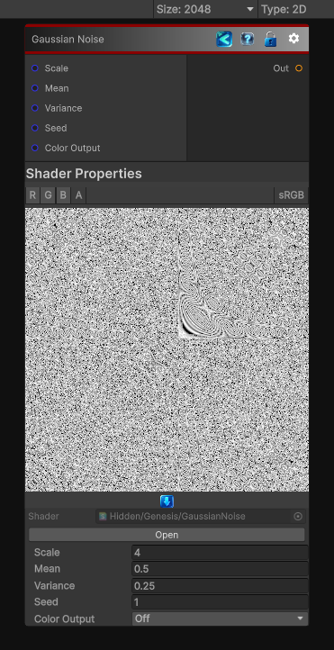

<link rel="stylesheet" href="../_assets/theme.css">

<button type="button" class="genesis-theme-toggle" data-genesis-theme-toggle aria-label="Toggle theme">Dark</button>

---
category: "Generators/Noise"
---

# Gaussian Noise

> Generates gaussian noise procedural noise.

## Description

Generates gaussian noise procedural noise.

Inputs:
- No external inputs. This node generates its output from its internal parameters.

Settings:
- No additional settings. This node is controlled by its built-in behavior.

Output:
- A generated procedural texture based on the node parameters.

## Inputs

| Name | Type | Description |
|------|------|-------------|
| Scale | Single | Global scale of the noise field |
| Mean | Single | Mean of the Gaussian distribution |
| Variance | Single | Standard deviation (spread) of the Gaussian |
| Seed | Single | Random seed |
| Color Output | Single | Output RGB instead of grayscale |

## Outputs

| Name | Type |
|------|------|
| Out | Texture2D |

## Parameters

| Setting | Type | Default | Description |
|---------|------|---------|-------------|
| Scale | Float | 4.0 | Global scale of the noise field |
| Mean | Float | 0.5 | Mean of the Gaussian distribution |
| Variance | Float | 0.25 | Standard deviation (spread) of the Gaussian |
| Seed | Float | 1.0 | Random seed |
| Color Output | Enum | 0 | Output RGB instead of grayscale |

## See Also

- [Back to Gaussian Noise](./generators-index.md)
