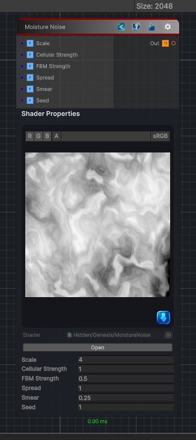

<link rel="stylesheet" href="../_assets/theme.css">

<button type="button" class="genesis-theme-toggle" data-genesis-theme-toggle aria-label="Toggle theme">Dark</button>

---
category: "Generators/Noise"
---

# Moisture Noise

> Generates moisture noise procedural noise.

## Description

Generates moisture noise procedural noise.

Inputs:
- No external inputs. This node generates its output from its internal parameters.

Settings:
- No additional settings. This node is controlled by its built-in behavior.

Output:
- A generated procedural texture based on the node parameters.

## Inputs

| Name | Type | Description |
|------|------|-------------|
| Scale | Single | Global scale of the moisture pattern |
| Cellular Strength | Single | Cellular (Worley) influence |
| FBM Strength | Single | FBM breakup influence |
| Spread | Single | Spread and wetness falloff |
| Smear | Single | Directional smear amount |
| Seed | Single | Random seed |

## Outputs

| Name | Type |
|------|------|
| Out | Texture2D |

## Parameters

| Setting | Type | Default | Description |
|---------|------|---------|-------------|
| Scale | Float | 4.0 | Global scale of the moisture pattern |
| Cellular Strength | Float | 1.0 | Cellular (Worley) influence |
| FBM Strength | Float | 0.5 | FBM breakup influence |
| Spread | Float | 1.0 | Spread and wetness falloff |
| Smear | Float | 0.25 | Directional smear amount |
| Seed | Float | 1.0 | Random seed |

## See Also

- [Back to Moisture Noise](./generators-index.md)
