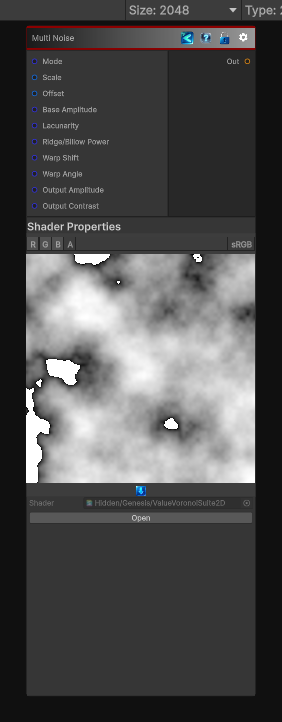

<link rel="stylesheet" href="../_assets/theme.css">

<button type="button" class="genesis-theme-toggle" data-genesis-theme-toggle aria-label="Toggle theme">Dark</button>

---
category: "Generators/Noise"
---

# Multi Noise

> Generates multi noise procedural noise.

## Description

Generates multi noise procedural noise.

Inputs:
- No external inputs. This node generates its output from its internal parameters.

Settings:
- No additional settings. This node is controlled by its built-in behavior.

Output:
- A generated procedural texture based on the node parameters.

## Inputs

| Name | Type | Description |
|------|------|-------------|

## Outputs

| Name | Type |
|------|------|

## Parameters

| Setting | Type | Default | Description |
|---------|------|---------|-------------|
| Mode | int | 0 | FBM Value 0, Ridge Value 1, Billow Value 2, TurbulenceValue 3, FBM Voronoi 4, BIllow Voronoi 5, Turbulence Voronoi 6, Warping Value 7 |
| Scale | Vector | (4,4,0,0) | Frequency and tiling |
| Offset | Vector | (0,0,0,0) | Offset in noise space |
| Octaves | Range | 5 | Octaves |
| Base Amplitude | Range | 1.0 | Base amplitude |
| Lacunarity | Range | 0.5 | Lacunarity (amplitude multiplier) |
| Ridge/Billow Power | Range | 1.0 | Ridge and Billow power |
| Warp Shift | Float | 1.0 | Warp shift |
| Warp Angle | Float | 0.5 | Warp rotation angle (radians) |
| Output Amplitude | Range | 1.0 | Output amplitude |
| Output Contrast | Range | 1.0 | Output contrast |

## See Also

- [Back to Multi Noise](./generators-index.md)
