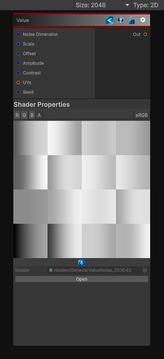

<link rel="stylesheet" href="../_assets/theme.css">

<button type="button" class="genesis-theme-toggle" data-genesis-theme-toggle aria-label="Toggle theme">Dark</button>

---
category: "Generators/Noise"
---

# Value

> Generates value procedural noise.

## Description

Generates value procedural noise.

Inputs:
- No external inputs. This node generates its output from its internal parameters.

Settings:
- No additional settings. This node is controlled by its built-in behavior.

Output:
- A generated procedural texture based on the node parameters.

## Inputs

| Name | Type | Description |
|------|------|-------------|

## Outputs

| Name | Type |
|------|------|

## Parameters

| Setting | Type | Default | Description |
|---------|------|---------|-------------|
| Noise Dimension | Enum | 0 | Controls the noise dimension. |
| Scale | Vector | (4,4,4,4) | Frequency and tiling |
| Offset | Vector | (0,0,0,0) | Offset in noise space |
| Amplitude | Range | 1.0 | Amplitude |
| Contrast | Range | 1.0 | Contrast shaping |
| Seed | Int | 0 | Controls the seed. |

## See Also

- [Back to Value](./generators-index.md)
