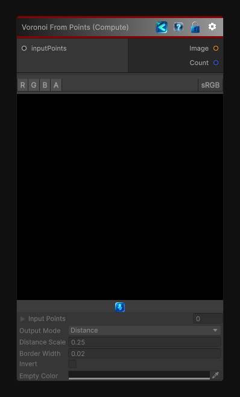

<link rel="stylesheet" href="../_assets/theme.css">

<button type="button" class="genesis-theme-toggle" data-genesis-theme-toggle aria-label="Toggle theme">Dark</button>

---
category: "Generators/Noise"
---

# Voronoi From Points (Compute)

> Generates a Voronoi texture from an input set of points.

## Description

Generates a Voronoi texture from an input set of points.

Inputs:
- inputPoints (List<Vector2>): Connected input point positions used to build the Voronoi result.

Settings:
- outputMode: Controls the output mode used by the generator.
- distanceScale: Adjusts the distance scale used by the generator.
- borderWidth: Adjusts the border width used by the generator.
- invert: Enables or disables invert for the generated result.
- emptyColor: Sets the empty color used by the generated result.

Output:
- A Voronoi texture and the generated point count.

## Inputs

| Name | Type | Description |
|------|------|-------------|

## Outputs

| Name | Type |
|------|------|

## Parameters

| Setting | Type | Default | Description |
|---------|------|---------|-------------|
| outputMode | OutputMode | Distance | |
| distanceScale | Single | 0.25 | |
| borderWidth | Single | 0.02 | |
| invert | Boolean | False | |
| emptyColor | Color | RGBA(0.000, 0.000, 0.000, 1.000) | |
| nodeVariables | VariableStorage | AhahGames.GenesisNoise.Graph.VariableStorage | |
| GUID | String | c3c78d5f-b45d-4be6-beb6-960725dcdbed | |
| expanded | Boolean | False | |

## See Also

- [Back to Voronoi From Points (Compute)](./generators-index.md)
