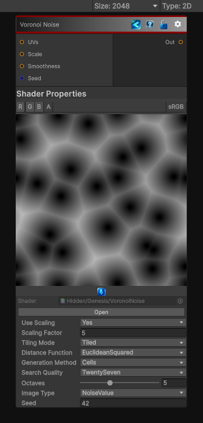

<link rel="stylesheet" href="../_assets/theme.css">

<button type="button" class="genesis-theme-toggle" data-genesis-theme-toggle aria-label="Toggle theme">Dark</button>

---
category: "Generators/Noise"
---

# Voronoi Noise

> Generates voronoi noise procedural noise.

## Description

Generates voronoi noise procedural noise.

Inputs:
- No external inputs. This node generates its output from its internal parameters.

Settings:
- No additional settings. This node is controlled by its built-in behavior.

Output:
- A generated procedural texture based on the node parameters.

## Inputs

| Name | Type | Description |
|------|------|-------------|

## Outputs

| Name | Type |
|------|------|

## Parameters

| Setting | Type | Default | Description |
|---------|------|---------|-------------|
| Use Scaling | Enum | 1 | Controls the use scaling. |
| Scaling Factor | Float | 5 | Controls the scaling factor. |
| Tiling Mode | Enum | 1 | Controls the tiling mode. |
| Distance Function | Enum | 0 | Controls the distance function. |
| Minkowski Power | Float | 1 | Controls the minkowski power. |
| Generation Method | Enum | 0 | Controls the generation method. |
| Search Quality | Enum | 27 | Controls the search quality. |
| Octaves | Int Range | 5 | Controls the octaves. |
| Image Type | Enum | 0 | Controls the image type. |
| Seed | Int | 42 | Controls the seed. |

## See Also

- [Back to Voronoi Noise](./generators-index.md)
