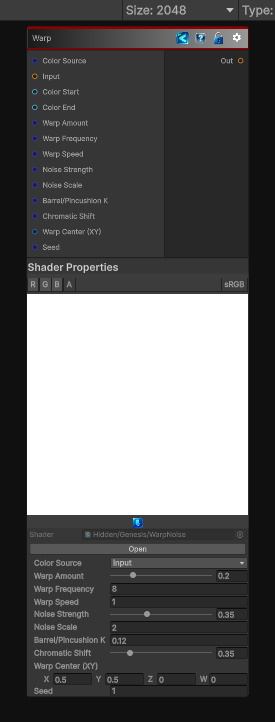

<link rel="stylesheet" href="../_assets/theme.css">

<button type="button" class="genesis-theme-toggle" data-genesis-theme-toggle aria-label="Toggle theme">Dark</button>

---
category: "Generators/Noise"
---

# Warp Noise

> Generates warp noise procedural noise.

## Description

Generates warp noise procedural noise.

Inputs:
- No external inputs. This node generates its output from its internal parameters.

Settings:
- No additional settings. This node is controlled by its built-in behavior.

Output:
- A generated procedural texture based on the node parameters.

## Inputs

| Name | Type | Description |
|------|------|-------------|

## Outputs

| Name | Type |
|------|------|

## Parameters

| Setting | Type | Default | Description |
|---------|------|---------|-------------|
| Color Source | Enum | 0 | Use source as color input or generate from selected colors |
| Color Start | Color | (0.25,0.0,0.25,1) | Starting point for color curve |
| Color End | Color | (1,0.0,1,1) | Ending point for color curve |
| Warp Amount | Range | 0.2 | Controls the warp amount. |
| Warp Frequency | Float | 8.0 | Controls the warp frequency. |
| Warp Speed | Float | 1.0 | Controls the warp speed. |
| Noise Strength | Range | 0.35 | Controls the noise strength. |
| Noise Scale | Float | 2.0 | Controls the noise scale. |
| Barrel/Pincushion K | Float | 0.12   // >0 barrel, <0 pincushion | Controls the barrel/pincushion k. |
| Chromatic Shift | Range | 0.35 | Controls the chromatic shift. |
| Warp Center (XY) | Vector | (0.5, 0.5, 0, 0) | Controls the warp center (xy). |
| Seed | Float | 1.0 | Seed driving time phase of the warp |

## See Also

- [Back to Warp Noise](./generators-index.md)
