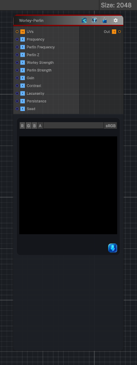

<link rel="stylesheet" href="../_assets/theme.css">

<button type="button" class="genesis-theme-toggle" data-genesis-theme-toggle aria-label="Toggle theme">Dark</button>

---
category: "Generators/Noise"
---

# Worley-Perlin

> Generates worley perlin procedural noise.

## Description

Generates worley perlin procedural noise.

Inputs:
- No external inputs. This node generates its output from its internal parameters.

Settings:
- No additional settings. This node is controlled by its built-in behavior.

Output:
- A generated procedural texture based on the node parameters.

## Inputs

| Name | Type | Description |
|------|------|-------------|
| UVs | Texture2D |  |
| Frequency | Single |  |
| Perlin Frequency | Single |  |
| Perlin Z | Single |  |
| Worley Strength | Single |  |
| Perlin Strength | Single |  |
| Gain | Single |  |
| Contrast | Single |  |
| Lacunarity | Single |  |
| Persistance | Single |  |
| Seed | Single |  |

## Outputs

| Name | Type |
|------|------|
| Out | Texture2D |

## Parameters

| Setting | Type | Default | Description |
|---------|------|---------|-------------|
| Tiling Mode | Keyword Enum | 1 | Controls the tiling mode. |
| Output Range | Vector2 | (0, 1, 0, 0) | Controls the output range. |
| Frequency | Float | 1.0 | Controls the frequency. |
| Perlin Frequency | Float | 8.0 | Controls the perlin frequency. |
| Worley Cell Size | Float | 32.0 | Controls the worley cell size. |
| Perlin Z | Float | 0.0 | Controls the perlin z. |
| Worley Strength | Range | 1.0 | Controls the worley strength. |
| Perlin Strength | Range | 1.0 | Controls the perlin strength. |
| Gain | Range | 1.0 | Controls the gain. |
| Contrast | Range | 1.0 | Controls the contrast. |
| Lacunarity | Float | 2.0 | Controls the lacunarity. |
| Persistance | Float | 0.5 | Controls the persistance. |
| Worley Octaves | Int Range | 3 | Controls the worley octaves. |
| Seed | Int | 42 | Controls the seed. |
| Channels | Enum | 0 | Select how many noise values to generate and on which channel. |

## See Also

- [Back to Worley-Perlin](./generators-index.md)
