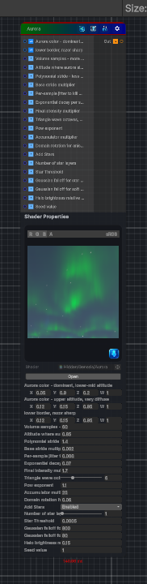

<link rel="stylesheet" href="../_assets/theme.css">

<button type="button" class="genesis-theme-toggle" data-genesis-theme-toggle aria-label="Toggle theme">Dark</button>

---
category: "Generators/Other"
---

# Aurora

> Generates aurora procedural noise.

## Description

Generates aurora procedural noise.

Inputs:
- No external inputs. This node generates its output from its internal parameters.

Settings:
- No additional settings. This node is controlled by its built-in behavior.

Output:
- A generated procedural texture based on the node parameters.

## Inputs

| Name | Type | Description |
|------|------|-------------|
| Aurora color - dominant, lower-mid altitude | Vector4 |  |
| lower border, razor sharp | Vector4 |  |
| Volume samples - more = smoother | Single |  |
| Altitude where aurora slab begins | Single |  |
| Polynomial stride - less aggressive for smoother sampling | Single |  |
| Base stride multiplier | Single |  |
| Per-sample jitter to kill banding | Single |  |
| Exponential decay per sample | Single |  |
| Final intensity multiplier | Single |  |
| Triangle wave octaves, more for smoother detail | Single |  |
| Pow exponent | Single |  |
| Accumulator multiplier | Single |  |
| Domain rotation for anisotropic banding | Single |  |
| Add Stars | Single |  |
| Number of star layers | Single |  |
| Star Threshold | Single |  |
| Gaussian falloff for star core | Single |  |
| Gaussian falloff for soft halo | Single |  |
| Halo brightness relative to core | Single |  |
| Seed value | Single |  |

## Outputs

| Name | Type |
|------|------|
| Out | Texture2D |

## Parameters

| Setting | Type | Default | Description |
|---------|------|---------|-------------|
| nodeVariables | VariableStorage | AhahGames.GenesisNoise.Graph.VariableStorage | |
| GUID | String | db843a7f-21e5-47b5-8607-fa1ae66c575f | |
| expanded | Boolean | False | |

## See Also

- [Back to Aurora](./generators-index.md)
