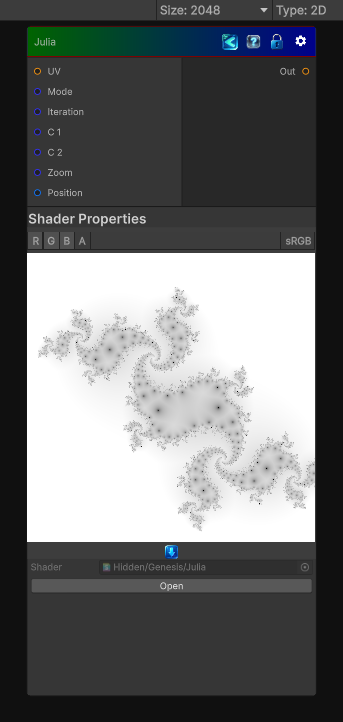

<link rel="stylesheet" href="../_assets/theme.css">

<button type="button" class="genesis-theme-toggle" data-genesis-theme-toggle aria-label="Toggle theme">Dark</button>

---
category: "Generators/Other"
---

# Julia

> Generates julia procedural noise.

## Description

Generates julia procedural noise.

Inputs:
- No external inputs. This node generates its output from its internal parameters.

Settings:
- No additional settings. This node is controlled by its built-in behavior.

Output:
- A generated procedural texture based on the node parameters.

## Inputs

| Name | Type | Description |
|------|------|-------------|

## Outputs

| Name | Type |
|------|------|

## Parameters

| Setting | Type | Default | Description |
|---------|------|---------|-------------|
| Center | Vector | (0.0, 0.0, 0, 0) | Controls the center. |
| Scale | Float | 2.5 | Controls the scale. |
| Iterations | Range | 256 | Controls the iterations. |
| Julia Constant (c) | Vector | (-0.8, 0.156, 0, 0) | Controls the julia constant (c). |
| Color Offset | Float | 0.0 | Controls the color offset. |
| Color Frequency | Float | 0.15 | Controls the color frequency. |
| Brightness | Float | 1.0 | Controls the brightness. |
| Contrast | Float | 1.0 | Controls the contrast. |
| Orbit Trap Type (0=Circle,1=Cross,2=Point) | Range | 0 | Controls the orbit trap type (0=circle,1=cross,2=point). |
| Trap Radius | Float | 0.25 | Controls the trap radius. |
| Trap Softness | Float | 4.0 | Controls the trap softness. |
| Trap Color | Color | (1,0.5,0.1,1) | Controls the trap color. |
| Trap Intensity | Float | 1.0 | Controls the trap intensity. |

## See Also

- [Back to Julia](./generators-index.md)
