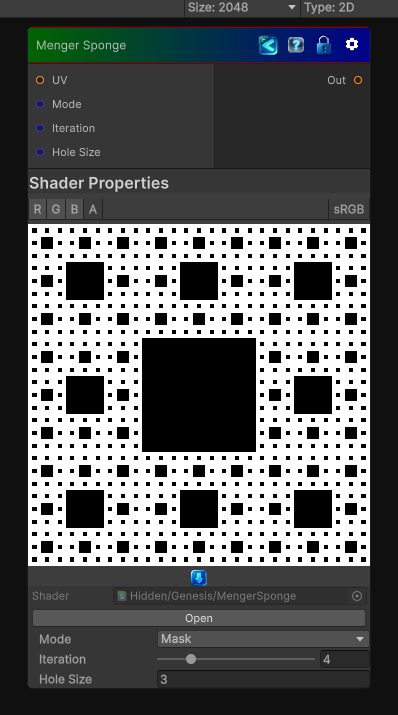

<link rel="stylesheet" href="../_assets/theme.css">

<button type="button" class="genesis-theme-toggle" data-genesis-theme-toggle aria-label="Toggle theme">Dark</button>

---
category: "Generators/Other"
---

# Menger Sponge

> Generates menger sponge procedural noise.

## Description

Generates menger sponge procedural noise.

Inputs:
- No external inputs. This node generates its output from its internal parameters.

Settings:
- No additional settings. This node is controlled by its built-in behavior.

Output:
- A generated procedural texture based on the node parameters.

## Inputs

| Name | Type | Description |
|------|------|-------------|

## Outputs

| Name | Type |
|------|------|

## Parameters

| Setting | Type | Default | Description |
|---------|------|---------|-------------|
| Mode | Enum | 0 | Controls the mode. |
| Iteration | Range | 4 | Controls the iteration. |
| Hole Size | Float | 3 | Controls the hole size. |

## See Also

- [Back to Menger Sponge](./generators-index.md)
