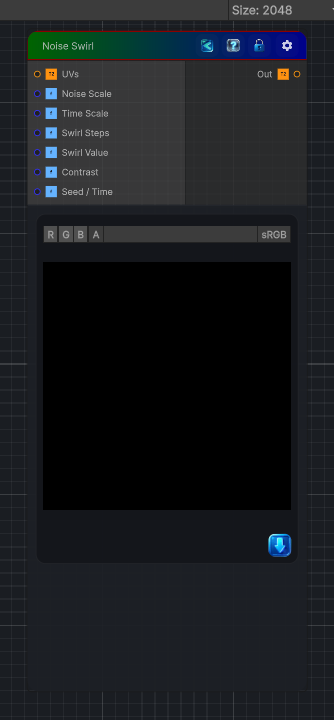

<link rel="stylesheet" href="../_assets/theme.css">

<button type="button" class="genesis-theme-toggle" data-genesis-theme-toggle aria-label="Toggle theme">Dark</button>

---
category: "Generators/Other"
---

# Noise Swirl

> Generates noise swirl procedural noise.

## Description

Generates noise swirl procedural noise.

Inputs:
- No external inputs. This node generates its output from its internal parameters.

Settings:
- No additional settings. This node is controlled by its built-in behavior.

Output:
- A generated procedural texture based on the node parameters.

## Inputs

| Name | Type | Description |
|------|------|-------------|
| UVs | Texture2D |  |
| Noise Scale | Single |  |
| Time Scale | Single |  |
| Swirl Steps | Single |  |
| Swirl Value | Single |  |
| Contrast | Single |  |
| Seed / Time | Single |  |

## Outputs

| Name | Type |
|------|------|
| Out | Texture2D |

## Parameters

| Setting | Type | Default | Description |
|---------|------|---------|-------------|
| Tiling Mode | Keyword Enum | 1 | Controls the tiling mode. |
| UV Mode | Enum | 0 | Controls the uv mode. |
| Noise Scale | Float | 2.0 | Controls the noise scale. |
| Time Scale | Float | 0.1 | Controls the time scale. |
| Swirl Steps | Int Range | 2 | Controls the swirl steps. |
| Swirl Value | Float | 1.0 | Controls the swirl value. |
| Contrast | Float | 2.0 | Controls the contrast. |
| Seed / Time | Float | 0.0 | Controls the seed / time. |

## See Also

- [Back to Noise Swirl](./generators-index.md)
