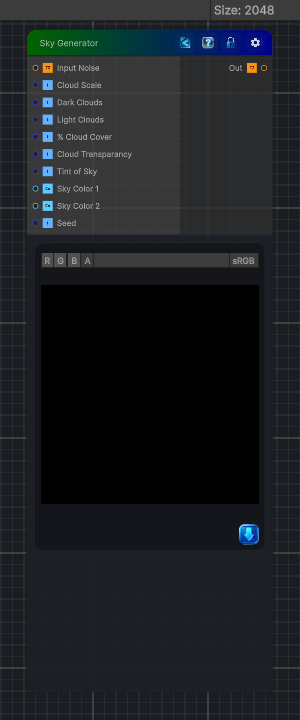

<link rel="stylesheet" href="../_assets/theme.css">

<button type="button" class="genesis-theme-toggle" data-genesis-theme-toggle aria-label="Toggle theme">Dark</button>

---
category: "Generators/Other"
---

# Sky Generator

> Generates sky procedural noise.

## Description

Generates sky procedural noise.

Inputs:
- No external inputs. This node generates its output from its internal parameters.

Settings:
- No additional settings. This node is controlled by its built-in behavior.

Output:
- A generated procedural texture based on the node parameters.

## Inputs

| Name | Type | Description |
|------|------|-------------|
| Input Noise | Texture2D |  |
| Cloud Scale | Single | Scale of the clouds, larger is bigger clouds |
| Dark Clouds | Single |  |
| Light Clouds | Single |  |
| % Cloud Cover | Single |  |
| Cloud Transparancy | Single |  |
| Tint of Sky | Single |  |
| Sky Color 1 | Color |  |
| Sky Color 2 | Color |  |
| Seed | Single |  |

## Outputs

| Name | Type |
|------|------|
| Out | Texture2D |

## Parameters

| Setting | Type | Default | Description |
|---------|------|---------|-------------|
| Cloud Scale | Range | .25 | Scale of the clouds, larger is bigger clouds |
| Dark Clouds | Range | 0.5 | Controls the dark clouds. |
| Light Clouds | Range | 0.3 | Controls the light clouds. |
| % Cloud Cover | Range | 0.3 | Controls the % cloud cover. |
| Cloud Transparancy | Range | 8.0 | Controls the cloud transparancy. |
| Tint of Sky | Range | 0.5 | Controls the tint of sky. |
| Sky Color 1 | Color | (0.2,0.4,0.6,1.0) | Controls the sky color 1. |
| Sky Color 2 | Color | (0.4,0.7,1.0,1.0) | Controls the sky color 2. |
| Seed | Float | 52 | Controls the seed. |

## See Also

- [Back to Sky Generator](./generators-index.md)
