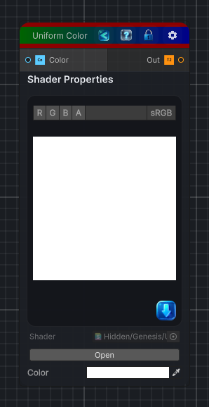

<link rel="stylesheet" href="../_assets/theme.css">

<button type="button" class="genesis-theme-toggle" data-genesis-theme-toggle aria-label="Toggle theme">Dark</button>

---
category: "Generators/Other"
---

# Uniform Color

> Generates a texture filled with a single uniform color.

## Description

Generates a texture filled with a single uniform color.

Inputs:
- No external inputs. This node generates its output from its internal parameters.

Settings:
- No additional settings. This node is controlled by its built-in behavior.

Output:
- A texture filled with the selected uniform color.

## Inputs

| Name | Type | Description |
|------|------|-------------|
| Color | Color | Color used to fill the entire output texture |

## Outputs

| Name | Type |
|------|------|
| Out | Texture2D |

## Parameters

| Setting | Type | Default | Description |
|---------|------|---------|-------------|
| Color | Color | (1.0, 1.0, 1.0, 1.0) | Color used to fill the entire output texture |

## See Also

- [Back to Uniform Color](./generators-index.md)
