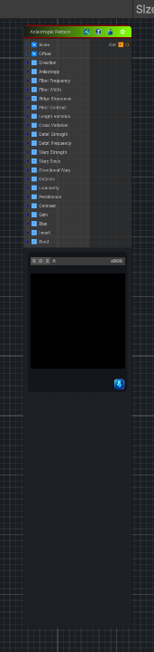

<link rel="stylesheet" href="../_assets/theme.css">

<button type="button" class="genesis-theme-toggle" data-genesis-theme-toggle aria-label="Toggle theme">Dark</button>

---
category: "Generators/Pattern"
---

# Anisotropic Noise 1

> Generates stacked anisotropic strip noise similar to Substance Designer's Anisotropic Noise.

## Description

Generates stacked anisotropic strip noise similar to Substance Designer's Anisotropic Noise.

Inputs:
- No external inputs. This node generates its output from its internal parameters.

Settings:
- X Amount and Y Amount control how many directional strips and stacked bands are produced.
- Y Amount By Resolution keeps the secondary band count proportional to the output resolution.
- Rotate flips the strip direction by 90 degrees.
- Smoothness and Smoothness Interpolation control how softly neighboring grayscale strips blend, from more linear to more gaussian-like fades.
- Disorder and Disorder Speed add stable procedural variation to strip boundaries and luminance.
- Non-square expansion compensates for texture aspect ratio when desired.

Output:
- A grayscale strip-based anisotropic pattern with smooth transitions between randomized bands.

## Inputs

| Name | Type | Description |
|------|------|-------------|
| Scale | Vector4 | Global UV scale |
| Offset | Vector4 | Global UV offset |
| Direction | Single | Fiber direction in radians |
| Anisotropy | Single | Longitudinal stretch. Higher means longer fibers |
| Fiber Frequency | Single | Base fiber density repetition |
| Fiber Width | Single | Fiber width shaping |
| Ridge Sharpness | Single | Ridge sharpness |
| Fiber Contrast | Single | Fiber contrast |
| Length Variation | Single | Longitudinal intensity variation |
| Cross Variation | Single | Cross fiber breakup amount |
| Detail Strength | Single | Micro detail amount |
| Detail Frequency | Single | Micro detail frequency |
| Warp Strength | Single | Domain warp strength |
| Warp Scale | Single | Domain warp scale |
| Directional Warp | Single | Secondary directional warp |
| Octaves | Single | Number of fBm octaves |
| Lacunarity | Single | Frequency multiplier |
| Persistence | Single | Amplitude multiplier |
| Contrast | Single | Final contrast shaping |
| Gain | Single | Final gain |
| Bias | Single | Final bias |
| Invert | Single | Invert output |
| Seed | Single | Random seed |

## Outputs

| Name | Type |
|------|------|
| Out | Texture2D |

## Parameters

| Setting | Type | Default | Description |
|---------|------|---------|-------------|
| Scale | Vector | (8,8,0,0) | Global UV scale |
| Offset | Vector | (0,0,0,0) | Global UV offset |
| Direction | Range | 0.0 | Fiber direction in radians |
| Anisotropy | Range | 10.0 | Longitudinal stretch. Higher means longer fibers |
| Fiber Frequency | Range | 28.0 | Base fiber density repetition |
| Fiber Width | Range | 2.5 | Fiber width shaping |
| Ridge Sharpness | Range | 5.0 | Ridge sharpness |
| Fiber Contrast | Range | 2.0 | Fiber contrast |
| Length Variation | Range | 1.25 | Longitudinal intensity variation |
| Cross Variation | Range | 0.8 | Cross fiber breakup amount |
| Detail Strength | Range | 0.5 | Micro detail amount |
| Detail Frequency | Range | 64.0 | Micro detail frequency |
| Warp Strength | Range | 0.25 | Domain warp strength |
| Warp Scale | Range | 3.0 | Domain warp scale |
| Directional Warp | Range | 0.2 | Secondary directional warp |
| Octaves | Range | 4 | Number of fBm octaves |
| Lacunarity | Range | 2.0 | Frequency multiplier |
| Persistence | Range | 0.5 | Amplitude multiplier |
| Contrast | Range | 1.0 | Final contrast shaping |
| Gain | Range | 1.0 | Final gain |
| Bias | Range | 0.0 | Final bias |
| Invert | Range | 0 | Invert output |
| Seed | int | 1 | Random seed |

## See Also

- [Back to Anisotropic Noise 1](./generators-index.md)
