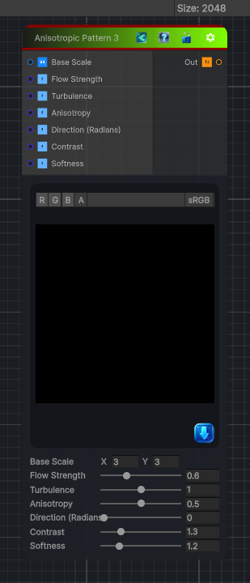

<link rel="stylesheet" href="../_assets/theme.css">

<button type="button" class="genesis-theme-toggle" data-genesis-theme-toggle aria-label="Toggle theme">Dark</button>

---
category: "Generators/Pattern"
---

# Anisotropic Noise 3

> Generates anisotropic node 3 procedural noise.

## Description

Generates anisotropic node 3 procedural noise.

Inputs:
- No external inputs. This node generates its output from its internal parameters.

Settings:
- No additional settings. This node is controlled by its built-in behavior.

Output:
- A generated procedural texture based on the node parameters.

## Inputs

| Name | Type | Description |
|------|------|-------------|
| Base Scale | Vector4 |  |
| Flow Strength | Single |  |
| Turbulence | Single |  |
| Anisotropy | Single |  |
| Direction (Radians) | Single |  |
| Contrast | Single |  |
| Softness | Single |  |

## Outputs

| Name | Type |
|------|------|
| Out | Texture2D |

## Parameters

| Setting | Type | Default | Description |
|---------|------|---------|-------------|
| Base Scale | Vector2 | (3,3,0,0) | Controls the base scale. |
| Flow Strength | Range | 0.6 | Controls the flow strength. |
| Turbulence | Range | 1.0 | Controls the turbulence. |
| Anisotropy | Range | 0.5 | Controls the anisotropy. |
| Direction (Radians) | Range | 0.0 | Controls the direction (radians). |
| Contrast | Range | 1.3 | Controls the contrast. |
| Softness | Range | 1.2 | Controls the softness. |

## See Also

- [Back to Anisotropic Noise 3](./generators-index.md)
