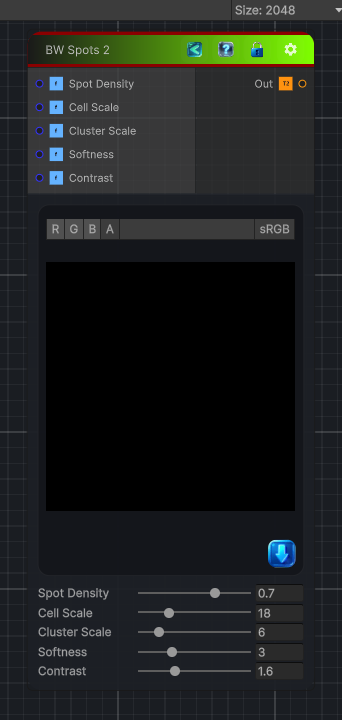

<link rel="stylesheet" href="../_assets/theme.css">

<button type="button" class="genesis-theme-toggle" data-genesis-theme-toggle aria-label="Toggle theme">Dark</button>

---
category: "Generators/Pattern"
---

# BW Spots 2

> Generates bwspots 2 procedural noise.

## Description

Generates bwspots 2 procedural noise.

Inputs:
- No external inputs. This node generates its output from its internal parameters.

Settings:
- No additional settings. This node is controlled by its built-in behavior.

Output:
- A generated procedural texture based on the node parameters.

## Inputs

| Name | Type | Description |
|------|------|-------------|
| Spot Density | Single |  |
| Cell Scale | Single |  |
| Cluster Scale | Single |  |
| Softness | Single |  |
| Contrast | Single |  |

## Outputs

| Name | Type |
|------|------|
| Out | Texture2D |

## Parameters

| Setting | Type | Default | Description |
|---------|------|---------|-------------|
| Spot Density | Range | 0.7 | Controls the spot density. |
| Cell Scale | Range | 18.0 | Controls the cell scale. |
| Cluster Scale | Range | 6.0 | Controls the cluster scale. |
| Softness | Range | 3.0 | Controls the softness. |
| Contrast | Range | 1.6 | Controls the contrast. |

## See Also

- [Back to BW Spots 2](./generators-index.md)
