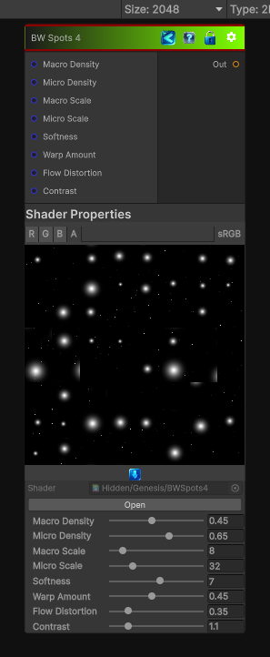

<link rel="stylesheet" href="../_assets/theme.css">

<button type="button" class="genesis-theme-toggle" data-genesis-theme-toggle aria-label="Toggle theme">Dark</button>

---
category: "Generators/Pattern"
---

# BW Spots 4

> Generates bwspots 4 procedural noise.

## Description

Generates bwspots 4 procedural noise.

Inputs:
- No external inputs. This node generates its output from its internal parameters.

Settings:
- No additional settings. This node is controlled by its built-in behavior.

Output:
- A generated procedural texture based on the node parameters.

## Inputs

| Name | Type | Description |
|------|------|-------------|

## Outputs

| Name | Type |
|------|------|

## Parameters

| Setting | Type | Default | Description |
|---------|------|---------|-------------|
| Macro Density | Range | 0.45 | Controls the macro density. |
| Micro Density | Range | 0.65 | Controls the micro density. |
| Macro Scale | Range | 8.0 | Controls the macro scale. |
| Micro Scale | Range | 32.0 | Controls the micro scale. |
| Softness | Range | 7.0 | Controls the softness. |
| Warp Amount | Range | 0.45 | Controls the warp amount. |
| Flow Distortion | Range | 0.35 | Controls the flow distortion. |
| Contrast | Range | 1.1 | Controls the contrast. |

## See Also

- [Back to BW Spots 4](./generators-index.md)
