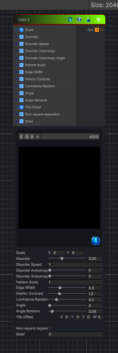

<link rel="stylesheet" href="../_assets/theme.css">

<button type="button" class="genesis-theme-toggle" data-genesis-theme-toggle aria-label="Toggle theme">Dark</button>

---
category: "Generators/Pattern"
---

# Cells 3

> Generates cells 3 procedural noise.

## Description

Generates cells 3 procedural noise.

Inputs:
- No external inputs. This node generates its output from its internal parameters.

Settings:
- No additional settings. This node is controlled by its built-in behavior.

Output:
- A generated procedural texture based on the node parameters.

## Inputs

| Name | Type | Description |
|------|------|-------------|
| Scale | Vector4 |  |
| Disorder | Single |  |
| Disorder Speed | Single |  |
| Disorder Anisotropy | Single |  |
| Disorder Anisotropy Angle | Single |  |
| Pattern Scale | Single |  |
| Edge Width | Single |  |
| Interior Contrast | Single |  |
| Luminance Random | Single |  |
| Angle | Single |  |
| Angle Random | Single |  |
| Tile Offset | Vector4 |  |
| Non-square expansion | Single |  |
| Seed | Single |  |

## Outputs

| Name | Type |
|------|------|
| Out | Texture2D |

## Parameters

| Setting | Type | Default | Description |
|---------|------|---------|-------------|
| Scale | Vector2 | (8,8,0,0) | Controls the scale. |
| Disorder | Range | 0.35 | Controls the disorder. |
| Disorder Speed | Float | 1.0 | Controls the disorder speed. |
| Disorder Anisotropy | Range | 0.0 | Controls the disorder anisotropy. |
| Disorder Anisotropy Angle | Range | 0.0 | Controls the disorder anisotropy angle. |
| Pattern Scale | Float | 1.0 | Controls the pattern scale. |
| Edge Width | Range | 0.30 | Controls the edge width. |
| Interior Contrast | Range | 1.5 | Controls the interior contrast. |
| Luminance Random | Range | 0.20 | Controls the luminance random. |
| Angle | Range | 0.0 | Controls the angle. |
| Angle Random | Range | 0.08 | Controls the angle random. |
| Tile Offset | Vector | (0,0,0,0) | Controls the tile offset. |
| Non-square expansion | Toggle | 0 | Controls the non-square expansion. |
| Seed | Float | 0 | Controls the seed. |

## See Also

- [Back to Cells 3](./generators-index.md)
