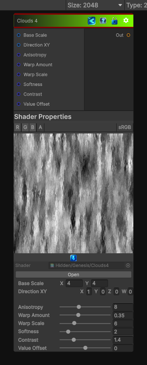

<link rel="stylesheet" href="../_assets/theme.css">

<button type="button" class="genesis-theme-toggle" data-genesis-theme-toggle aria-label="Toggle theme">Dark</button>

---
category: "Generators/Pattern"
---

# Clouds 4

> Generates clouds 4 procedural noise.

## Description

Generates clouds 4 procedural noise.

Inputs:
- No external inputs. This node generates its output from its internal parameters.

Settings:
- No additional settings. This node is controlled by its built-in behavior.

Output:
- A generated procedural texture based on the node parameters.

## Inputs

| Name | Type | Description |
|------|------|-------------|

## Outputs

| Name | Type |
|------|------|

## Parameters

| Setting | Type | Default | Description |
|---------|------|---------|-------------|
| Base Scale | Vector2 | (4,4,0,0) | Controls the base scale. |
| Direction XY | Vector | (1,0,0,0) | Controls the direction xy. |
| Anisotropy | Range | 8.0 | Controls the anisotropy. |
| Warp Amount | Range | 0.35 | Controls the warp amount. |
| Warp Scale | Range | 6.0 | Controls the warp scale. |
| Softness | Range | 2.0 | Controls the softness. |
| Contrast | Range | 1.4 | Controls the contrast. |
| Value Offset | Range | 0.0 | Controls the value offset. |

## See Also

- [Back to Clouds 4](./generators-index.md)
