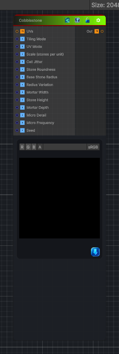

<link rel="stylesheet" href="../_assets/theme.css">

<button type="button" class="genesis-theme-toggle" data-genesis-theme-toggle aria-label="Toggle theme">Dark</button>

---
category: "Generators/Pattern"
---

# Cobblestone

> Generates cobblestone procedural noise.

## Description

Generates cobblestone procedural noise.

Inputs:
- No external inputs. This node generates its output from its internal parameters.

Settings:
- No additional settings. This node is controlled by its built-in behavior.

Output:
- A generated procedural texture based on the node parameters.

## Inputs

| Name | Type | Description |
|------|------|-------------|
| UVs | Texture2D |  |
| Tiling Mode | Single |  |
| UV Mode | Single |  |
| Scale (stones per unit) | Single |  |
| Cell Jitter | Single |  |
| Stone Roundness | Single |  |
| Base Stone Radius | Single |  |
| Radius Variation | Single |  |
| Mortar Width | Single |  |
| Stone Height | Single |  |
| Mortar Depth | Single |  |
| Micro Detail | Single |  |
| Micro Frequency | Single |  |
| Seed | Single |  |

## Outputs

| Name | Type |
|------|------|
| Out | Texture2D |

## Parameters

| Setting | Type | Default | Description |
|---------|------|---------|-------------|
| Tiling Mode | Keyword Enum | 1 | Controls the tiling mode. |
| UV Mode | Enum | 0 | Controls the uv mode. |
| Scale (stones per unit) | Float | 6 | Controls the scale (stones per unit). |
| Cell Jitter | Range | 0.6 | Controls the cell jitter. |
| Stone Roundness | Range | 1.0 | Controls the stone roundness. |
| Base Stone Radius | Range | 0.35 | Controls the base stone radius. |
| Radius Variation | Range | 0.12 | Controls the radius variation. |
| Mortar Width | Range | 0.08 | Controls the mortar width. |
| Stone Height | Float | 0.6 | Controls the stone height. |
| Mortar Depth | Float | 0.0 | Controls the mortar depth. |
| Micro Detail | Float | 0.12 | Controls the micro detail. |
| Micro Frequency | Float | 8.0 | Controls the micro frequency. |
| Seed | Int | 42 | Controls the seed. |

## See Also

- [Back to Cobblestone](./generators-index.md)
