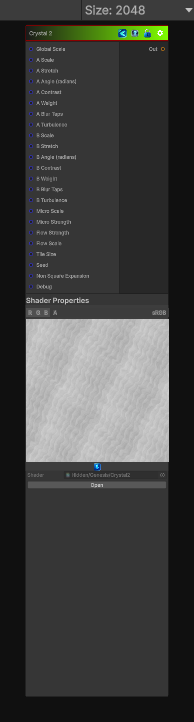

<link rel="stylesheet" href="../_assets/theme.css">

<button type="button" class="genesis-theme-toggle" data-genesis-theme-toggle aria-label="Toggle theme">Dark</button>

---
category: "Generators/Pattern"
---

# Crystal 2

> Generates crystal 2 procedural noise.

## Description

Generates crystal 2 procedural noise.

Inputs:
- No external inputs. This node generates its output from its internal parameters.

Settings:
- No additional settings. This node is controlled by its built-in behavior.

Output:
- A generated procedural texture based on the node parameters.

## Inputs

| Name | Type | Description |
|------|------|-------------|

## Outputs

| Name | Type |
|------|------|

## Parameters

| Setting | Type | Default | Description |
|---------|------|---------|-------------|
| Global Scale | Float | 4.0 | Controls the global scale. |
| Micro Scale | Float | 18.0 | Controls the micro scale. |
| Micro Strength | Range | 0.35 | Controls the micro strength. |
| Flow Strength | Range | 0.28 | Controls the flow strength. |
| Flow Scale | Float | 3.5 | Controls the flow scale. |
| Tile Size | Float | 8.0 | Controls the tile size. |
| Seed | Float | 0.0 | Controls the seed. |
| Non Square Expansion | Float | 0.0 | Controls the non square expansion. |
| Debug | Enum | 4 | Controls the debug. |

## See Also

- [Back to Crystal 2](./generators-index.md)
