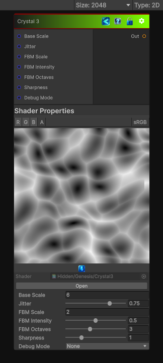

<link rel="stylesheet" href="../_assets/theme.css">

<button type="button" class="genesis-theme-toggle" data-genesis-theme-toggle aria-label="Toggle theme">Dark</button>

---
category: "Generators/Pattern"
---

# Crystal 3

> Generates crystal 3 procedural noise.

## Description

Generates crystal 3 procedural noise.

Inputs:
- No external inputs. This node generates its output from its internal parameters.

Settings:
- No additional settings. This node is controlled by its built-in behavior.

Output:
- A generated procedural texture based on the node parameters.

## Inputs

| Name | Type | Description |
|------|------|-------------|

## Outputs

| Name | Type |
|------|------|

## Parameters

| Setting | Type | Default | Description |
|---------|------|---------|-------------|
| Base Scale | Float | 6.0 | Controls the base scale. |
| Jitter | Range | 0.75 | Controls the jitter. |
| FBM Scale | Float | 2.0 | Controls the fbm scale. |
| FBM Intensity | Range | 0.5 | Controls the fbm intensity. |
| FBM Octaves | Range | 3 | Controls the fbm octaves. |
| Sharpness | Range | 1.0 | Controls the sharpness. |
| Debug Mode | Enum | 0 | Controls the debug mode. |

## See Also

- [Back to Crystal 3](./generators-index.md)
