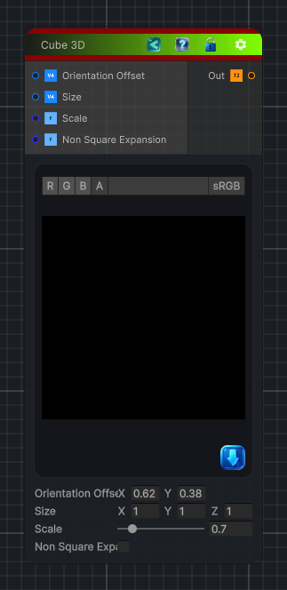

<link rel="stylesheet" href="../_assets/theme.css">

<button type="button" class="genesis-theme-toggle" data-genesis-theme-toggle aria-label="Toggle theme">Dark</button>

---
category: "Generators/Pattern"
---

# Cube 3D

> Renders a grayscale, shaded 3D cube whose brightness also represents screen depth.

## Description

Renders a grayscale, shaded 3D cube whose brightness also represents screen depth.

Parameters:
- Orientation Offset rotates the cube around its X and Y axes.
- Size scales the cube independently on each axis.
- Scale uniformly scales the complete cube.
- Non Square Expansion compensates for non-square output dimensions.

Output:
- A crisp grayscale cube texture with depth-based face shading.

## Inputs

| Name | Type | Description |
|------|------|-------------|
| Orientation Offset | Vector4 |  |
| Size | Vector4 |  |
| Scale | Single |  |
| Non Square Expansion | Single |  |

## Outputs

| Name | Type |
|------|------|
| Out | Texture2D |

## Parameters

| Setting | Type | Default | Description |
|---------|------|---------|-------------|
| Orientation Offset | Vector2 | (0.62, 0.38, 0, 0) | Controls the orientation offset. |
| Size | Vector | (1, 1, 1, 0) | Controls the size. |
| Scale | Range | 0.7 | Controls the scale. |
| Non Square Expansion | Toggle | 0 | Controls the non square expansion. |

## See Also

- [Back to Cube 3D](./generators-index.md)
