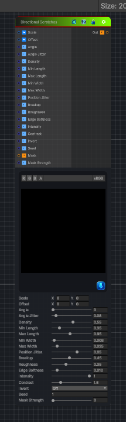

<link rel="stylesheet" href="../_assets/theme.css">

<button type="button" class="genesis-theme-toggle" data-genesis-theme-toggle aria-label="Toggle theme">Dark</button>

---
category: "Generators/Pattern"
---

# Directional Scratches

> Generates directional scratches procedural noise.

## Description

Generates directional scratches procedural noise.

Inputs:
- No external inputs. This node generates its output from its internal parameters.

Settings:
- No additional settings. This node is controlled by its built-in behavior.

Output:
- A generated procedural texture based on the node parameters.

## Inputs

| Name | Type | Description |
|------|------|-------------|
| Scale | Vector4 | Global UV scale |
| Offset | Vector4 | Global UV offset |
| Angle | Single | Direction of the scratches in radians |
| Angle Jitter | Single | Random angle variation per scratch |
| Density | Single | Number of potential scratches per region |
| Min Length | Single | Minimum scratch length |
| Max Length | Single | Maximum scratch length |
| Min Width | Single | Minimum scratch width |
| Max Width | Single | Maximum scratch width |
| Position Jitter | Single | Random offset inside each scratch cell |
| Breakup | Single | Breaks scratches into worn segments |
| Roughness | Single | High frequency roughness along scratch edges |
| Edge Softness | Single | Softness at scratch edges and tips |
| Intensity | Single | Output intensity |
| Contrast | Single | Output contrast |
| Invert | Single | Invert the generated scratches |
| Seed | Single | Randomization seed |
| Mask | Texture2D | Optional mask texture |
| Mask Strength | Single | How strongly the mask limits scratches |

## Outputs

| Name | Type |
|------|------|
| Out | Texture2D |

## Parameters

| Setting | Type | Default | Description |
|---------|------|---------|-------------|
| Scale | Vector2 | (6, 6, 0, 0) | Global UV scale |
| Offset | Vector2 | (0, 0, 0, 0) | Global UV offset |
| Angle | Range | 0.0 | Direction of the scratches in radians |
| Angle Jitter | Range | 0.08 | Random angle variation per scratch |
| Density | Range | 0.55 | Number of potential scratches per region |
| Min Length | Range | 0.35 | Minimum scratch length |
| Max Length | Range | 0.95 | Maximum scratch length |
| Min Width | Range | 0.008 | Minimum scratch width |
| Max Width | Range | 0.025 | Maximum scratch width |
| Position Jitter | Range | 0.65 | Random offset inside each scratch cell |
| Breakup | Range | 0.45 | Breaks scratches into worn segments |
| Roughness | Range | 0.35 | High frequency roughness along scratch edges |
| Edge Softness | Range | 0.012 | Softness at scratch edges and tips |
| Intensity | Range | 1.0 | Output intensity |
| Contrast | Range | 1.5 | Output contrast |
| Invert | Enum | 0 | Invert the generated scratches |
| Seed | Float | 1.0 | Randomization seed |
| Mask | 2D | white | Optional mask texture |
| Mask Strength | Range | 0.0 | How strongly the mask limits scratches |

## See Also

- [Back to Directional Scratches](./generators-index.md)
