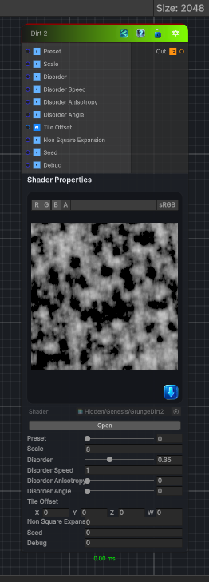

<link rel="stylesheet" href="../_assets/theme.css">

<button type="button" class="genesis-theme-toggle" data-genesis-theme-toggle aria-label="Toggle theme">Dark</button>

---
category: "Generators/Pattern"
---

# Dirt 2

> Generates dirt 2 procedural noise.

## Description

Generates dirt 2 procedural noise.

Inputs:
- No external inputs. This node generates its output from its internal parameters.

Settings:
- No additional settings. This node is controlled by its built-in behavior.

Output:
- A generated procedural texture based on the node parameters.

## Inputs

| Name | Type | Description |
|------|------|-------------|
| Preset | Single |  |
| Scale | Single |  |
| Disorder | Single |  |
| Disorder Speed | Single |  |
| Disorder Anisotropy | Single |  |
| Disorder Angle | Single |  |
| Tile Offset | Vector4 |  |
| Non Square Expansion | Single |  |
| Seed | Single |  |
| Debug | Single |  |

## Outputs

| Name | Type |
|------|------|
| Out | Texture2D |

## Parameters

| Setting | Type | Default | Description |
|---------|------|---------|-------------|
| nodeVariables | VariableStorage | AhahGames.GenesisNoise.Graph.VariableStorage | |
| GUID | String | 6aa11346-2891-4c2e-a1bd-3bb0d028ba29 | |
| expanded | Boolean | False | |

## See Also

- [Back to Dirt 2](./generators-index.md)
