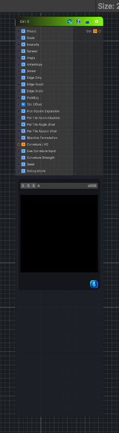

<link rel="stylesheet" href="../_assets/theme.css">

<button type="button" class="genesis-theme-toggle" data-genesis-theme-toggle aria-label="Toggle theme">Dark</button>

---
category: "Generators/Pattern"
---

# Dirt 3

> Generates dirt 3 procedural noise.

## Description

Generates dirt 3 procedural noise.

Inputs:
- No external inputs. This node generates its output from its internal parameters.

Settings:
- No additional settings. This node is controlled by its built-in behavior.

Output:
- A generated procedural texture based on the node parameters.

## Inputs

| Name | Type | Description |
|------|------|-------------|
| Preset | Single |  |
| Scale | Single |  |
| Intensity | Single |  |
| Spread | Single |  |
| Angle | Single |  |
| Anisotropy | Single |  |
| Smear | Single |  |
| Edge Only | Single |  |
| Edge Boost | Single |  |
| Edge Scale | Single |  |
| Padding | Single |  |
| Tile Offset | Vector4 |  |
| Non Square Expansion | Single |  |
| Per Tile Randomization | Single |  |
| Per Tile Angle Jitter | Single |  |
| Per Tile Aspect Jitter | Single |  |
| Bijective Permutation | Single |  |
| Curvature / AO | Texture2D |  |
| Use Curvature Input | Single |  |
| Curvature Strength | Single |  |
| Seed | Single |  |
| Debug Mode | Single |  |

## Outputs

| Name | Type |
|------|------|
| Out | Texture2D |

## Parameters

| Setting | Type | Default | Description |
|---------|------|---------|-------------|
| nodeVariables | VariableStorage | AhahGames.GenesisNoise.Graph.VariableStorage | |
| GUID | String | cd2c45e1-fa07-4bdc-98d1-0cc041d197e6 | |
| expanded | Boolean | False | |

## See Also

- [Back to Dirt 3](./generators-index.md)
