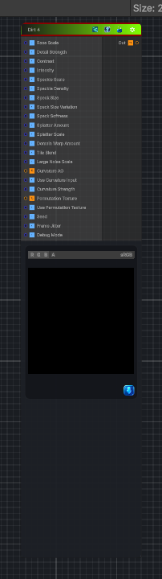

<link rel="stylesheet" href="../_assets/theme.css">

<button type="button" class="genesis-theme-toggle" data-genesis-theme-toggle aria-label="Toggle theme">Dark</button>

---
category: "Generators/Pattern"
---

# Dirt 4

> Generates dirt 4 procedural noise.

## Description

Generates dirt 4 procedural noise.

Inputs:
- No external inputs. This node generates its output from its internal parameters.

Settings:
- No additional settings. This node is controlled by its built-in behavior.

Output:
- A generated procedural texture based on the node parameters.

## Inputs

| Name | Type | Description |
|------|------|-------------|
| Base Scale | Single |  |
| Detail Strength | Single |  |
| Contrast | Single |  |
| Intensity | Single |  |
| Speckle Scale | Single |  |
| Speckle Density | Single |  |
| Speck Size | Single |  |
| Speck Size Variation | Single |  |
| Speck Softness | Single |  |
| Splatter Amount | Single |  |
| Splatter Scale | Single |  |
| Domain Warp Amount | Single |  |
| Tile Blend | Single |  |
| Large Noise Scale | Single |  |
| Curvature AO | Texture2D |  |
| Use Curvature Input | Single |  |
| Curvature Strength | Single |  |
| Permutation Texture | Texture2D |  |
| Use Permutation Texture | Single |  |
| Seed | Single |  |
| Frame Jitter | Single |  |
| Debug Mode | Single |  |

## Outputs

| Name | Type |
|------|------|
| Out | Texture2D |

## Parameters

| Setting | Type | Default | Description |
|---------|------|---------|-------------|
| nodeVariables | VariableStorage | AhahGames.GenesisNoise.Graph.VariableStorage | |
| GUID | String | 936e642c-80a1-4fa0-9193-49397987bff9 | |
| expanded | Boolean | False | |

## See Also

- [Back to Dirt 4](./generators-index.md)
