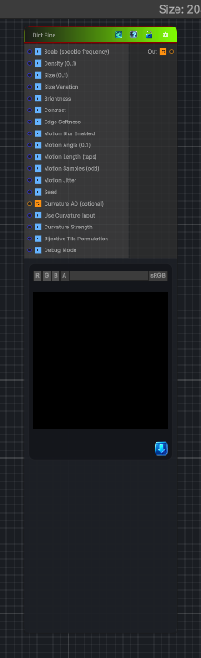

<link rel="stylesheet" href="../_assets/theme.css">

<button type="button" class="genesis-theme-toggle" data-genesis-theme-toggle aria-label="Toggle theme">Dark</button>

---
category: "Generators/Pattern"
---

# Dirt Fine

> Generates dirt fine procedural noise.

## Description

Generates dirt fine procedural noise.

Inputs:
- No external inputs. This node generates its output from its internal parameters.

Settings:
- No additional settings. This node is controlled by its built-in behavior.

Output:
- A generated procedural texture based on the node parameters.

## Inputs

| Name | Type | Description |
|------|------|-------------|
| Scale (speckle frequency) | Single |  |
| Density (0..1) | Single |  |
| Size (0..1) | Single |  |
| Size Variation | Single |  |
| Brightness | Single |  |
| Contrast | Single |  |
| Edge Softness | Single |  |
| Motion Blur Enabled | Single |  |
| Motion Angle (0..1) | Single |  |
| Motion Length (taps) | Single |  |
| Motion Samples (odd) | Single |  |
| Motion Jitter | Single |  |
| Seed | Single |  |
| Curvature AO (optional) | Texture2D |  |
| Use Curvature Input | Single |  |
| Curvature Strength | Single |  |
| Bijective Tile Permutation | Single |  |
| Debug Mode | Single |  |

## Outputs

| Name | Type |
|------|------|
| Out | Texture2D |

## Parameters

| Setting | Type | Default | Description |
|---------|------|---------|-------------|
| nodeVariables | VariableStorage | AhahGames.GenesisNoise.Graph.VariableStorage | |
| GUID | String | 475bd68b-658e-4a56-b126-8590af93d50c | |
| expanded | Boolean | False | |

## See Also

- [Back to Dirt Fine](./generators-index.md)
