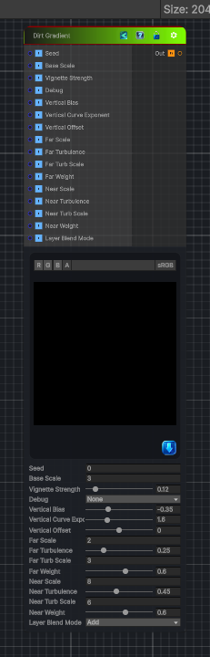

<link rel="stylesheet" href="../_assets/theme.css">

<button type="button" class="genesis-theme-toggle" data-genesis-theme-toggle aria-label="Toggle theme">Dark</button>

---
category: "Generators/Pattern"
---

# Dirt Gradient

> Generates dirt gradient procedural noise.

## Description

Generates dirt gradient procedural noise.

Inputs:
- No external inputs. This node generates its output from its internal parameters.

Settings:
- No additional settings. This node is controlled by its built-in behavior.

Output:
- A generated procedural texture based on the node parameters.

## Inputs

| Name | Type | Description |
|------|------|-------------|
| Seed | Single |  |
| Base Scale | Single |  |
| Vignette Strength | Single |  |
| Debug | Single |  |
| Vertical Bias | Single |  |
| Vertical Curve Exponent | Single |  |
| Vertical Offset | Single |  |
| Far Scale | Single |  |
| Far Turbulence | Single |  |
| Far Turb Scale | Single |  |
| Far Weight | Single |  |
| Near Scale | Single |  |
| Near Turbulence | Single |  |
| Near Turb Scale | Single |  |
| Near Weight | Single |  |
| Layer Blend Mode | Single |  |

## Outputs

| Name | Type |
|------|------|
| Out | Texture2D |

## Parameters

| Setting | Type | Default | Description |
|---------|------|---------|-------------|
| Seed | Float | 0.0 | Controls the seed. |
| Base Scale | Float | 3.0 | Controls the base scale. |
| Vignette Strength | Range | 0.12 | Controls the vignette strength. |
| Debug | Enum | 0 | Controls the debug. |
| Vertical Bias | Range | -0.35 | Controls the vertical bias. |
| Vertical Curve Exponent | Range | 1.6 | Controls the vertical curve exponent. |
| Vertical Offset | Range | 0.0 | Controls the vertical offset. |
| Far Scale | Float | 2.0 | Controls the far scale. |
| Far Turbulence | Range | 0.25 | Controls the far turbulence. |
| Far Turb Scale | Float | 3.0 | Controls the far turb scale. |
| Far Weight | Range | 0.6 | Controls the far weight. |
| Near Scale | Float | 8.0 | Controls the near scale. |
| Near Turbulence | Range | 0.45 | Controls the near turbulence. |
| Near Turb Scale | Float | 6.0 | Controls the near turb scale. |
| Near Weight | Range | 0.6 | Controls the near weight. |
| Layer Blend Mode | Enum | 0 // 0 = Add, 1 = Multiply, 2 = Max | Controls the layer blend mode. |

## See Also

- [Back to Dirt Gradient](./generators-index.md)
