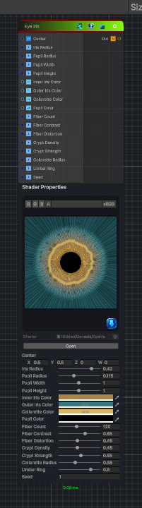

<link rel="stylesheet" href="../_assets/theme.css">

<button type="button" class="genesis-theme-toggle" data-genesis-theme-toggle aria-label="Toggle theme">Dark</button>

---
category: "Generators/Pattern"
---

# Eye Iris

> Generates a colored procedural eye iris.

## Description

Generates a colored procedural eye iris.

Inputs:
- Center positions the iris in the texture.
- Iris Radius and Pupil Radius control its silhouette.
- Inner, Outer, Collarette, and Pupil Color define the palette.
- Fiber Count, Fiber Contrast, and Fiber Distortion control radial striations.
- Crypt Density and Crypt Strength add irregular iris openings.
- Collarette Radius and Limbal Ring control characteristic iris rings.
- Seed generates a different deterministic pattern.

Output:
- A colored iris with transparent pixels outside its edge. The pupil remains opaque.

## Inputs

| Name | Type | Description |
|------|------|-------------|
| Center | Vector4 |  |
| Iris Radius | Single |  |
| Pupil Radius | Single |  |
| Inner Iris Color | Color |  |
| Outer Iris Color | Color |  |
| Collarette Color | Color |  |
| Pupil Color | Color |  |
| Fiber Count | Single |  |
| Fiber Contrast | Single |  |
| Fiber Distortion | Single |  |
| Crypt Density | Single |  |
| Crypt Strength | Single |  |
| Collarette Radius | Single |  |
| Limbal Ring | Single |  |
| Seed | Single |  |

## Outputs

| Name | Type |
|------|------|
| Out | Texture2D |

## Parameters

| Setting | Type | Default | Description |
|---------|------|---------|-------------|
| Center | Vector | (0.5, 0.5, 0, 0) | Controls the center. |
| Iris Radius | Range | 0.42 | Controls the iris radius. |
| Pupil Radius | Range | 0.115 | Controls the pupil radius. |
| Inner Iris Color | Color | (0.42, 0.23, 0.045, 1) | Controls the inner iris color. |
| Outer Iris Color | Color | (0.035, 0.19, 0.22, 1) | Controls the outer iris color. |
| Collarette Color | Color | (0.72, 0.47, 0.10, 1) | Controls the collarette color. |
| Pupil Color | Color | (0.002, 0.003, 0.004, 1) | Controls the pupil color. |
| Fiber Count | Range | 120 | Controls the fiber count. |
| Fiber Contrast | Range | 0.65 | Controls the fiber contrast. |
| Fiber Distortion | Range | 0.45 | Controls the fiber distortion. |
| Crypt Density | Range | 0.45 | Controls the crypt density. |
| Crypt Strength | Range | 0.55 | Controls the crypt strength. |
| Collarette Radius | Range | 0.38 | Controls the collarette radius. |
| Limbal Ring | Range | 0.8 | Controls the limbal ring. |
| Seed | Float | 1 | Controls the seed. |

## See Also

- [Back to Eye Iris](./generators-index.md)
